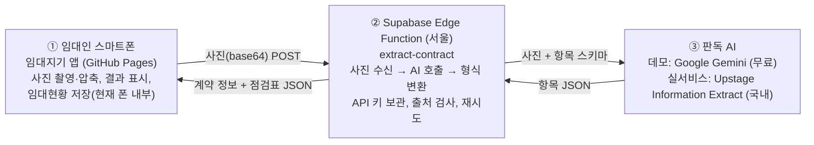

# 임대지기(RentKeeper) 기술 문서 · 협업 안내서

작성일 2026-09-04 · 작성 주체 대한세무법인 송진석 (Claude와 공동 작업) · 문서 버전 1.0
대상 독자: 앞으로 이 프로젝트에 합류할 개발자·디자이너·회사 내부 담당자. 개발 경험이 없는 분도 읽을 수 있게 썼습니다.

---

## 1. 한 장 요약

**임대지기**는 부동산 임대인이 스마트폰으로 임대차계약서를 촬영하면 AI가 내용을 읽어 임대현황(물건·임차인·보증금·임대료·기간)을 자동으로 등록하고, 임대료 수납·세금계산서·간주임대료·부가세 예상액을 관리해 주는 **모바일 웹앱**입니다.

사업 목적은 임대사업자 세무시장 확대의 연결고리입니다. 임대인은 생활 편의(임대 관리)를 얻고, 앱에 쌓인 데이터를 대한세무법인이 받아 임차인 확인이나 유선 연락 없이 **부가가치세·종합소득세 신고를 연 10만 원 수준으로 단순하게 마무리**하는 "세무 임대 커넥터"를 목표로 합니다.

현재 상태(2026-09-04): **1단계 데모 완료.** 폰에서 계약서를 촬영하면 서버가 AI로 판독해 임대현황에 자동 등록됩니다. 데이터는 아직 각 폰 안에만 저장되며, 로그인과 서버 DB 저장은 2단계 과제입니다.

| 항목 | 내용 |
|---|---|
| 앱 주소 | https://jssong-hub.github.io/workpace/rentkeeper/ |
| 코드 저장소 | GitHub `jssong-hub/workpace` (비공개→공개 여부는 저장소 설정 확인) |
| 서버 | Supabase 프로젝트 `rentkeeper` (서울 리전, 프로젝트 ID `lezpolceeqhdsgekidzi`) |
| 판독 AI | Google Gemini 무료 티어 (데모) → 실서비스 시 Upstage(국내)로 교체 예정 |
| 현재 비용 | 0원 |

---

## 2. 비개발자를 위한 용어 사전

| 용어 | 쉬운 설명 | 이 프로젝트에서의 예 |
|---|---|---|
| 저장소(Repository) | 코드와 변경 이력이 모두 들어 있는 폴더 | GitHub의 `workpace`, 바탕화면의 `workpace` 폴더 |
| 커밋(Commit) | "이 시점의 상태를 저장" — 변경 이력 한 칸 | "판독 서버 주소 연결" |
| 푸시(Push) | 내 컴퓨터의 커밋을 GitHub로 올리기 | GitHub Desktop의 Push origin 버튼 |
| GitHub Pages | 저장소 안의 HTML 파일을 그대로 웹사이트로 공개해 주는 무료 호스팅 | 앱 주소가 여기서 나옴 |
| 프론트엔드 / 앱 | 사용자가 폰에서 보는 화면 | `rentkeeper/index.html` 파일 하나 |
| 백엔드 / 서버 | 화면 뒤에서 일하는 컴퓨터 | Supabase Edge Function |
| Supabase | 서버·데이터베이스·로그인·파일저장을 한 곳에서 제공하는 서비스(회사가 이미 사용 중) | `rentkeeper` 프로젝트 |
| Edge Function | Supabase 안에서 돌아가는 작은 서버 프로그램 | `extract-contract` (계약서 판독) |
| API 키 | 외부 서비스를 쓰기 위한 열쇠 문자열 | Gemini 키 `AIza…` |
| 비밀값(Secret) | 서버에만 보관하는 값. 코드·폰에 절대 넣지 않음 | `GEMINI_API_KEY`, `ALLOWED_ORIGINS` |
| JSON | 컴퓨터끼리 데이터를 주고받는 글자 형식 | `{"deposit":30000000,"rent":1500000}` |
| localStorage | 폰 브라우저 안의 작은 저장공간 | 현재 임대현황이 저장되는 곳 |
| CORS / 허용 출처 | "이 주소에서 온 요청만 받아라"는 서버 문단속 | `https://jssong-hub.github.io` |
| RLS | DB에서 "각자 자기 행만 보게" 하는 규칙(2단계) | 임대인 A는 A의 계약만 |

---

## 3. 전체 구조



### 각 구성요소의 역할과 선택 이유

**① 앱 — HTML 한 파일, GitHub Pages**
설치 없이 폰 브라우저로 접속하는 웹앱입니다. 앱스토어 심사 없이 커밋·푸시만으로 즉시 배포되고 아이폰·안드로이드 구분이 없습니다. 프레임워크(React 등) 없이 순수 HTML/CSS/JavaScript 한 파일(약 980줄)로 만들어 빌드 도구가 필요 없고, 파일을 더블클릭해도 PC에서 실행됩니다. 개발 초기 속도와 단순함을 우선한 선택이며, 기능이 커지면 2단계에서 구조 분리를 검토합니다.

**② 서버 — Supabase Edge Function (Deno/TypeScript, 약 210줄)**
AI 열쇠를 폰에 두면 누구나 꺼내 쓸 수 있어 위험하므로, 열쇠는 서버에만 두고 폰은 서버에 사진만 보냅니다. 여러 후보(Cloudflare Workers, Vercel, Firebase 등) 중 Supabase를 택한 이유는 ⑴ 회사가 이미 사용 중, ⑵ 로그인·DB·파일저장·서버를 한 계정에서 제공해 2단계에서 다른 서비스를 붙일 필요가 없음, ⑶ 서울 리전 선택 가능(고객 데이터 국내 저장), ⑷ 무료 플랜으로 데모 가능. 즉 "두 번 일하지 않기" 위한 선택입니다.

**③ 판독 AI — 비밀값으로 교체 가능한 엔진**
사진 속 글자를 단순 인식(OCR)하는 대신 문서를 "이해"하는 AI에게 22개 항목표를 주고 채우게 합니다. 손글씨, 기울어진 사진, "金 삼천만 원정" 같은 한자 금액 표기도 문맥으로 읽습니다. 데모는 카드 등록 없이 무료인 Google Gemini를 쓰고, 실서비스는 국내 기업 Upstage로 전환합니다. 서버 코드가 두 엔진을 모두 담고 있어 **비밀값 하나만 추가하면 코드 수정 없이 교체**됩니다. 폰 자체에는 AI가 필요 없으므로 구형·저가 폰에서도 동일하게 동작합니다.

### 검토 후 채택하지 않은 방식 (기록용)

| 방식 | 결과 | 이유 |
|---|---|---|
| 폰 브라우저 안 OCR(Tesseract.js) | 폐기 | 실제 폰에서 인식 실패, 정확도 낮음 |
| 폰 내장 글자 인식(라이브 텍스트 등)으로 복사→붙여넣기 | 폐기 | 동작은 하지만 매번 복사·붙이기가 끼어 사용성이 나쁨 |
| Anthropic API 키를 폰 설정에 입력 | 폐기 | 사용자에게 설정을 요구, 키 노출 |
| Cloudflare Workers + Gemini | 구현 후 교체 | 판독 서버로는 우수하나 로그인·DB가 없어 2단계에 다른 서비스 추가 필요 |
| 네이버 CLOVA OCR | 보류 | 임대차계약서 특화 모델 없음(영수증·신분증 등만) |

---

## 4. 저장소 구조

```
workpace/                         ← GitHub 저장소 루트 (폴더명은 오타지만 주소에 쓰이므로 유지)
├─ index.html                     ← GitHub Pages 시작 페이지 (임대지기로 가는 링크)
├─ .nojekyll                      ← Pages가 파일을 가공하지 않게 하는 표시
├─ rentkeeper/index.html          ← ★ 임대지기 앱 본체 (영문 경로, 폰에서 여는 주소)
├─ 임대지기/
│   ├─ index.html                 ← 위와 동일한 파일 (한글 경로 사본, 초기 산출물)
│   ├─ README.md
│   └─ docs/임대지기_서비스기획서.docx   ← 서비스 기획서 (기능 명세·로드맵·법령 쟁점)
├─ supabase/
│   ├─ README.md                  ← 서버 설치·운영 안내 (단계별 화면 안내, 문제 해결)
│   ├─ config.toml                ← CLI 사용 시 함수 설정 (verify_jwt = false)
│   └─ functions/extract-contract/index.ts   ← ★ 판독 서버 코드
├─ docs/임대지기_기술문서.md        ← 이 문서
├─ CLAUDE.md                      ← Claude 작업 시 참고 메모 (개발 도구용)
└─ 집사방/, gstack/               ← 빈 폴더 / 개발 도구 관련 (앱과 무관)
```

> 주의: `rentkeeper/index.html`과 `임대지기/index.html`은 **같은 내용**이어야 합니다. 수정 시 두 곳을 함께 바꾸거나, 2단계에서 한글 폴더를 정리해 하나로 통합하는 것을 권합니다.

---

## 5. 앱(프론트엔드) 상세

### 5.1 기술 스택
순수 HTML5 + CSS + JavaScript(ES2020), 외부 라이브러리 없음(글꼴만 Google Fonts). 모바일 우선 레이아웃(최대 폭 480px, 하단 탭 5개, 바텀시트 모달), 라이트/다크 테마 자동. `<meta viewport>`와 안전영역(`viewport-fit=cover`) 적용, 홈 화면 추가(PWA 유사) 메타태그 포함.

### 5.2 데이터 모델 (폰 localStorage, 키 `imdaejigi.v1`)
하나의 JSON 객체 `S`에 모든 상태가 들어 있고 변경 시마다 `save()`가 저장합니다.

| 필드 | 내용 |
|---|---|
| `landlord` | 임대인 정보(성명·연락처·상호·사업자번호·주소·과세유형·이메일) |
| `taxAgent` | 지정 세무사(대한세무법인) 정보, 자료 공유 동의 여부 |
| `broker` | 지정 공인중개사무소 |
| `settings` | 간주임대료 이자율, 미입금 재알림 일수, 자동등록 여부, 매입세액 입력값 등 |
| `contracts[]` | 계약: `id, name, type(shop/office/house/land/etc), addr, area, tenant, tenantPhone, tenantBiz, tenantBizName, deposit, rent, mgmt, vatSeparate, payDay, start, end, memo, review[], quotes[], photos[](압축 JPEG dataURL), autoRegistered` |
| `rents{}` | 월별 납부 기록 (`계약id_YYYY-MM` → 납부일·금액) |
| `invoices{}` | 월별 세금계산서 발급 기록 |
| `threads[]` | 임차인·중개사 메시지 스레드(프로토타입) |
| `notifications[]`, `dismissed{}` | 알림 |
| `demo` | 예시 데이터 표시 여부 (첫 실제 등록 시 false) |

2단계에서 이 구조가 그대로 Supabase DB 테이블(`contracts`, `rent_payments`, `invoices` …)로 옮겨갑니다.

### 5.3 주요 기능
홈(이달 임대료 현황·확인 필요한 일), 계약 목록/상세(만료 타임라인, 납부 이력, 시세 비교, 계약서 사진 보기), 계약 추가(촬영→AI 판독→자동 등록 / 직접 입력), 알림(미입금·만료 예정), 메시지(임차인 문자 초안), 세무(월별 세금계산서 발급 체크, 간주임대료 계산, 부가세 예상, 홈택스 일괄발급용 CSV, 세무사 공유 파일 생성), 설정(임대인·세무사·중개사·기준값·백업/복원).

### 5.4 계약서 판독 흐름 (앱 쪽)
1. `openAdd()` — 촬영/앨범 선택. 선택된 사진은 `compressImage()`로 긴 변 1,400px·JPEG 78%로 압축(전송량·저장량 절약), 최대 6장.
2. `analyzeContract()` — `extractMode()`가 실행 환경을 판단: claude.ai 뷰어 안이면 뷰어 AI, 아니면 `EXTRACT_SERVER`(코드 상수)로 POST.
3. `extractViaServer()` — `{ images: [dataURL...] }`를 보내고 `{ ok, data }`를 받음.
4. 임대료·시작일·종료일이 모두 있고 "자동 등록" 체크가 켜져 있으면 `contracts`에 즉시 추가하고 상세 화면으로 이동(상단에 "AI 자동 등록 — 확인 필요" 배너). 하나라도 비면 값이 채워진 등록 양식을 열어 빈칸만 입력.
5. 사진은 계약과 함께 `photos[]`에 보관되어 상세에서 크게 볼 수 있음.

서버 주소는 `index.html`의 다음 한 줄에 고정되어 있으며 **사용자는 어떤 설정도 하지 않습니다.**
```js
const EXTRACT_SERVER = 'https://lezpolceeqhdsgekidzi.supabase.co/functions/v1/extract-contract';
```

---

## 6. 판독 서버(백엔드) 상세

파일: `supabase/functions/extract-contract/index.ts` (Deno 런타임, TypeScript)

### 6.1 처리 순서
1. `OPTIONS` 사전 요청과 `GET`(상태 확인: `{"ok":true,"service":"rentkeeper-extract","engine":"gemini"}`) 처리
2. `Origin` 헤더를 `ALLOWED_ORIGINS`와 비교 — 다르면 403 "허용되지 않은 출처입니다"
3. 요청 본문 검사: 이미지 1~6장, `data:image/...;base64,` 형식, 총 12MB 이하
4. `pickEngine()` — 비밀값에 따라 엔진 선택 (`UPSTAGE_API_KEY` 있으면 Upstage, 아니면 `GEMINI_API_KEY`로 Gemini, `ENGINE`으로 강제 지정 가능)
5. 엔진 호출. **22개 항목 스키마**(물건명·유형·소재지·면적·임차인·연락처·사업자번호·상호·보증금·월세·관리비·부가세별도·납부일·시작일·종료일·특약·연체이자/원상복구/갱신/해지 조항 유무·계약일)를 채우게 함
6. 결과를 앱 형식으로 변환(`toApp`)하고 **점검표 8항목**(당사자, 기간, 금액·납부일, 부가세 표기 또는 주택 면세 안내, 연체이자, 원상복구, 갱신, 주택 임대차신고/상가 사업자번호)을 생성
7. `{ ok:true, data, engine }` 반환. 사진·결과는 저장하지 않음

### 6.2 안정성 처리
- 429(사용량 초과)·5xx 시 0.6~0.8초부터 지수적으로 늘려 최대 3회 자동 재시도
- Gemini 모델 단종 안내("update your code to use models/xxx")가 오면 안내된 모델로 자동 재시도
- Gemini가 빈 답을 주면(생각 토큰이 출력 한도 소진) 생각 수준을 낮춰 1회 재시도, 그래도 비면 "사진을 더 밝고 선명하게" 안내
- 여러 장을 한 번에 못 읽으면 장별로 읽어 첫 유효값으로 합침

### 6.3 비밀값(Secrets) 목록

| 이름 | 필수 | 설명 |
|---|---|---|
| `GEMINI_API_KEY` | 데모 필수 | Google AI Studio 키 |
| `ALLOWED_ORIGINS` | 권장 | `https://jssong-hub.github.io` (비우면 모든 출처 허용) |
| `GEMINI_MODEL` | 선택 | 기본 `gemini-3.6-flash` |
| `UPSTAGE_API_KEY` | 실서비스 | 등록하면 자동으로 Upstage 사용 |
| `UPSTAGE_ENDPOINT` | 선택 | 기본 Upstage Information Extract 주소 |
| `ENGINE` | 선택 | `gemini` / `upstage` 강제 지정 |

### 6.4 함수 설정
"Verify JWT with legacy secret" = **OFF** (로그인 도입 전이라 누구나 호출 가능. 2단계에서 ON으로 바꿔 로그인 사용자만 호출하게 전환).

---

## 7. 배포 방식

### 7.1 앱 배포 (GitHub Pages)
1. `rentkeeper/index.html`(및 `임대지기/index.html`) 수정
2. GitHub Desktop에서 변경 확인 → Summary 입력 → **Commit to main** → **Push origin**
3. 1~2분 후 https://jssong-hub.github.io/workpace/rentkeeper/ 에 반영. 폰에서는 새로고침(캐시가 남으면 두 번)
- Pages 설정: 저장소 Settings → Pages → Deploy from a branch → `main` / `(root)`
- 되돌리기: GitHub Desktop History에서 이전 커밋 → Revert, 또는 `git revert`

### 7.2 서버 배포 (Supabase)
대시보드 방식(설치 프로그램 없음): Supabase → Edge Functions → `extract-contract` → **Code** 탭 → 기존 코드 전체 삭제 → `index.ts` 내용 붙여넣기 → **Deploy**.
비밀값 변경은 Edge Functions → **Secrets**에서 즉시 반영(재배포 불필요). 오류 확인은 함수의 **Logs** 탭.
CLI 방식(개발자용): `npx supabase login` → `npx supabase link --project-ref lezpolceeqhdsgekidzi` → `npx supabase functions deploy extract-contract`.

### 7.3 배포 후 확인
- 서버: 브라우저로 함수 주소를 열어 `"ok":true` 확인
- 앱: 폰에서 계약 추가 → 촬영 → 판독해서 등록 → 상세 화면 값 대조

---

## 8. 운영 정보 (계정·자산·비용)

| 자산 | 위치/식별자 | 관리자 | 비고 |
|---|---|---|---|
| GitHub 저장소 | `jssong-hub/workpace` | 송진석 | 협업자 초대: Settings → Collaborators |
| GitHub Pages | https://jssong-hub.github.io/workpace/ | 자동 | Public 저장소 필요(무료 플랜) |
| Supabase 프로젝트 | `rentkeeper` / `lezpolceeqhdsgekidzi` / 서울 | 회사 Supabase 조직 | 무료 플랜 — 7일 미접속 시 일시정지(대시보드에서 Restore) |
| Gemini API 키 | Google AI Studio (송진석 Google 계정) | 송진석 | 무료 티어. 분당 10~15건·하루 수백 건 한도 |
| 도메인 | 없음 (github.io 사용) | — | 실서비스 시 회사 도메인 연결 검토 |

비용: 현재 0원. 실서비스 전환 시 예상 — Supabase Pro 월 $25(약 3.5만 원), Upstage 페이지당 $0.04(계약서 1건 약 150원), 도메인 연 1~2만 원.

---

## 9. 보안·개인정보 현황과 과제

현재 지켜지는 것: AI 키는 서버 비밀값에만 존재. 서버는 지정 출처에서 온 요청만 처리. 사진·판독 결과는 서버에 저장되지 않음. 고객 데이터 DB는 서울 리전(2단계).

알아야 할 제약: **Gemini 무료 티어는 입력 데이터가 Google 서비스 개선에 사용될 수 있음** → 데모 기간에는 실제 고객 계약서를 쓰지 말고 테스트 계약서 사용. 실제 고객 단계 전에 Upstage(국내) 또는 유료 티어로 전환. 판독 함수가 현재 누구나 호출 가능(로그인 전) → 2단계에서 인증 필수화.

2단계 전에 정리할 것: 개인정보 처리방침(임차인 성명·연락처·사업자번호 수집 근거 및 회사 제공 고지), 세무대리 계약과 홈택스 수임 동의 절차, 세무사법·한국세무사회 광고 규정 검토, Upstage 데이터 보관 정책 원문 확인.

---

## 10. 알려진 한계 · 기술 부채

- 데이터가 폰 localStorage에만 있음 → 기기 변경·브라우저 데이터 삭제 시 소실, 회사에서 조회 불가 (2단계 핵심 과제)
- 앱 파일이 두 곳(`rentkeeper/`, `임대지기/`)에 중복 → 통합 필요
- 저장소 폴더명 `workpace`(오타) → 주소에 포함되어 있어 변경 시 링크가 바뀜. 실서비스 도메인 연결 시 함께 정리
- 앱이 단일 파일 980줄 → 기능 확장 시 파일 분리·빌드 도구 도입 검토
- 예시(데모) 데이터가 첫 실행 시 표시됨 → 실서비스에서는 제거
- 실제 Gemini/Upstage 호출은 실제 환경에서만 검증됨(개발 환경은 외부망 차단이라 가짜 응답으로 단위 테스트)
- 판독 정확도는 아직 실제 계약서 표본으로 충분히 측정되지 않음 → 다양한 양식(상가·주택 표준계약서, 손글씨)으로 정확도 표 작성 필요

---

## 11. 로드맵

**1단계 (완료)** 모바일 앱 + 촬영 → AI 판독 → 자동 등록, 서울 서버, 무료 데모 구성.

**2단계 — 로그인 + 데이터 서버 저장 (구현 완료, 운영자 설정 대기)**
- Supabase Authentication: 휴대폰 인증번호 또는 카카오 로그인
- DB 테이블: `landlords`, `properties`, `contracts`, `rent_payments`, `invoices`, `contract_photos`(Storage 경로), `submissions`(회사 접수)
- RLS: 임대인은 자기 행만, 회사 직원 역할은 전체
- 앱: localStorage → Supabase 동기화(오프라인 시 로컬 임시 저장 후 업로드)
- 판독 함수 JWT 검증 ON, 판독 결과·사진을 DB/Storage에 저장

**3단계 — 회사 접수·신고 자료**
- 임대인 신고 프로필(사업자번호·과세유형·주업종코드·임대주택 등록 여부·공동사업 지분)
- 부동산임대공급가액명세서 자동 생성, 간주임대료 계산 반영
- 신고 기간별 "자료 마감" 패키지(부가세 1·2기, 사업장현황신고, 종소세)와 완결성 점검(사업자번호 누락, 미발급 월, 통장 불일치 등)
- 은행 거래내역 CSV 업로드 → 임대료 입금 자동 매칭
- 회사용 접수 대시보드(접수→검토→신고완료→납부안내 상태), 초기에는 Supabase Table Editor로 대체

**4단계 — 편의·확장**
- 주소 입력 시 건축물대장 API로 면적·용도 자동 채우기(공공데이터포털, 무료)
- 중개사 입력 링크(계약 체결 시 구조화 입력)
- 판독 엔진 Upstage 전환, 유료 플랜, 회사 도메인
- 임차인 문자 발송(알림톡), 만료 알림 푸시

---

## 12. 협업 방법

### 12.1 역할 제안
- 기획·세무 도메인·검수: 송진석 (요구사항, 세법 검증, 고객 테스트)
- 개발: 프론트엔드(앱), 백엔드(Supabase 함수·DB·RLS) — 초기엔 1명이 겸임 가능
- 디자인: 화면·아이콘·브랜드 (현재는 기본 디자인)

### 12.2 작업 흐름
1. 할 일은 GitHub **Issues**에 한 건씩 기록(제목 + 기대 동작 + 화면 캡처)
2. 개발자는 `main`에서 브랜치를 만들어 작업 → **Pull Request** → 검토 후 `main`에 합치면 자동 배포(Pages)
3. 서버 코드 변경은 PR 합친 뒤 Supabase에 배포(대시보드 또는 CLI). 비밀값은 대시보드에서만 변경
4. 커밋 메시지는 한국어로 "무엇을 왜" 한 줄 (예: `판독 함수: 빈 응답 시 재시도 추가`)
5. 릴리스 단위로 이 문서의 이력 표를 갱신

### 12.3 개발자 온보딩 체크리스트
- [ ] GitHub 저장소 협업자 초대 (Settings → Collaborators)
- [ ] Supabase 조직 → `rentkeeper` 프로젝트 멤버 초대 (Developer 권한)
- [ ] 이 문서와 `supabase/README.md`, `임대지기/docs/서비스기획서.docx` 읽기
- [ ] 로컬 실행: 저장소 clone → `rentkeeper/index.html`을 브라우저로 열기(또는 VS Code Live Server). 폰 크기 확인은 브라우저 개발자도구 기기 모드
- [ ] 서버 로컬 실행(선택): `npx supabase start` + `npx supabase functions serve extract-contract --env-file .env`
- [ ] 테스트 계약서(개인정보 없는 표준 양식) 2~3종 확보

### 12.4 설명할 때 쓰는 한 문장 버전
"임대인이 폰 브라우저로 임대지기에 접속해 계약서를 찍으면, 사진이 회사 Supabase 서버(서울)로 가고 서버가 AI에게 읽혀 보증금·월세·기간·임차인을 뽑아 앱에 자동 등록합니다. 폰에는 AI가 필요 없고, 열쇠는 서버에만 있으며, 지금은 무료 AI로 데모 중이고 실서비스에서는 국내 판독 서비스로 바꿉니다. 다음 단계는 로그인과 서버 DB 저장입니다."

---

## 13. 개발 이력

| 일자 | 내용 |
|---|---|
| 2026-08 | 임대지기 기획, 서비스기획서 작성, 프로토타입(claude.ai 아티팩트) 제작 |
| 2026-09-03 | GitHub 저장소·Pages 배포. 모바일 화면 구조(viewport) 수정. 계약서 촬영·보관·뷰어 재작성 |
| 2026-09-03 | 판독 방식 검토: 브라우저 OCR → 폰 내장 인식 붙여넣기 → Cloudflare+Gemini → **Supabase+AI**로 확정 |
| 2026-09-03 | Supabase `rentkeeper`(서울) 생성, Edge Function 배포, 비밀값 등록, 앱에 서버 주소 연결. Gemini 모델명·빈 응답 오류 수정 |
| 2026-09-04 | 기술 문서·서비스 백서·브리핑 작성. 폰 실기 테스트로 1단계 검증 완료(실제 계약서 판독 성공) |
| 2026-09-04 | 2단계 구현: 이메일 로그인(카카오는 스위치), Supabase DB(app_state·profiles·staff·extract_logs, RLS, 회사용 뷰), 계약서 사진 Storage, 판독 함수 로그인 필수화. 설치 안내 `supabase/STEP2_로그인_서버저장.md` |

---

## 14. 자주 받을 질문

**앱스토어 앱이 아닌데 괜찮은가?** 데모·초기 고객 단계에서는 웹앱이 배포·수정이 훨씬 빠릅니다. 카메라·홈 화면 추가·알림(안드로이드) 모두 웹으로 가능하며, 필요해지면 같은 코드를 감싸 스토어용 앱으로 만들 수 있습니다.

**왜 데이터를 회사 서버에 바로 저장하지 않았나?** 먼저 판독 품질을 확인하는 것이 우선이었고, 저장·로그인은 개인정보 처리 설계가 따라와야 해서 2단계로 분리했습니다.

**AI가 틀리게 읽으면?** 자동 등록된 계약에는 "확인 필요" 배너와 8항목 점검표가 붙고, 수정 버튼으로 바로 고칠 수 있습니다. 임대료·기간을 못 읽으면 자동 등록 대신 양식이 열립니다.

**비용은?** 현재 0원. 실서비스 기준 고정비 월 3~4만 원 + 계약서 1건당 150원 안팎.

---

세법 관련 계산(간주임대료·부가세·면세 판정 등)은 앱이 참고용으로 제시하는 것이며, 실제 신고 적용 전 담당 세무사의 최종 검토가 필요합니다.
